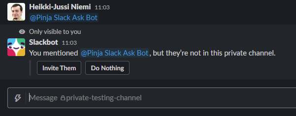
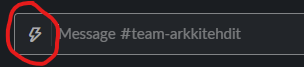
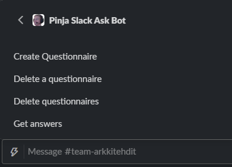
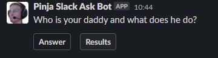

# How to use

This document describes how Slack Ask Bot is used from Slack. For Console App
usage, see [Usage](ConsoleApp.md#usage) in console application help.

Note: This guide assumes that the Slack App is installed to the workspace with
name `Pinja Slack Ask Bot`.

Note: Slack Ask Bot can't send questionnaires to private channels before bot
is invited to the channel. This can be done by writing `@Pinja Slack Ask Bot`
(bot name prefixed with @-character) and pressing invite button which should
appear if bot is not already in channel and can ne invited.

Important: Don't use `Pinja Slack Ask Bot` to for confidental questionnairies.
With current implementation, the questions and answers are visible to all
workspace participants. Also, the data is easily available in Azure.

## Creating questionnaires

Questionnaires can be created with Shortcuts-button in slack. This button is on
the left side of the message field.

This button shows a list of shortcuts provided by different applications and
each workspace may have different application. Select `Pinja Slack Ask Bot`
from the list. This shows all options available for the Slack Ask Bot.

Choosing `Create questionnaire` will open a dialog which allows user to define
the question, available options and to which channel the questionnaire is sent
to. Options can be added or removed with the `Add another option` or
`Delete option` -buttons. Title and the options supports emojis available in
workspace, but those are not visible when written in the dialog.

After pressing `Submit` questionnaire is sent to the channel and can be
answerred there.

## Answering questionnaire

When questionnaire is sent to channel, it can be answerred with `Answer` button
in the message. This shows the dialog where user can choose their answer and
submit it. It also shows previous answer given by user if user has already
answerred this questionnaire.

If user answers twice, the second answer replaces the old answer given by user.
The old answer is shown in answer dialog.

## Checking answers

To show answers, click `Results` button from the questionnaire message. This
will post questionnaire results as an answer to the questionnaire message. This
creates a thread and further clicks will send new messages with current
results.

The post doesn't show which user has answerred what option.

## Deleting questionnaires

To delete questionnaires, select `Delete a questionnaire` from the shortcut
menu. This will show all questionnaires and user can choose any
questionnaire. After questionnaire is selected and `Submit` is pressed, the
questionnaire is deleted!

When question is deleted:

* Final results are posted to the thread, same as `Results` would be pressed.
* Closing message is posted indicating that questionnaire can no longer be
answered.
* `Answer` and  `Results` -buttons are removed from the message.
* Questionnaire and answers are deleted from storage.
